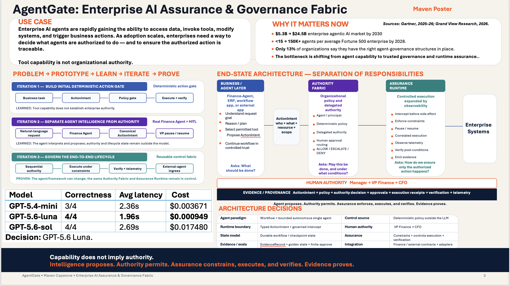

# AgentGate

## Enterprise AI Assurance & Governance Fabric

AI agents now have advanced capabilities to perform complex tasks —
but capability does not mean authority.

AgentGate separates what an agent can do from what the enterprise
allows it to do, routes the appropriate approvals, and verifies that
execution matches what was authorized.

## Maven Capstone Poster

[View / Download the Poster](./agentgate-maven-poster.pdf)

## Core Idea

**Capability ≠ Authority**

Intelligence proposes.  
Authority permits.  
Assurance constrains, executes, and verifies.  
Evidence proves.
